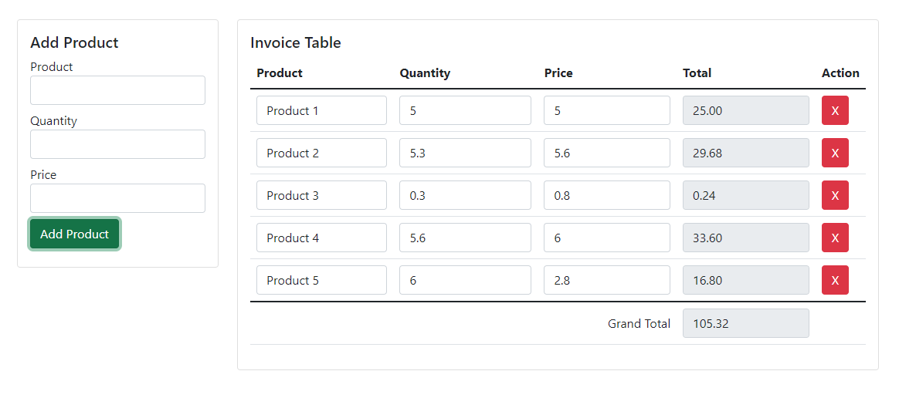

## Title
“Vanilla JavaScript Invoice System | Building an Invoice System for Stock & Inventory or Web Applications”

## For Users
It is basic project for learners.

## Languages & Libraries
- HTML
-  [Bootstrap 5](https://getbootstrap.com/)
- Vanilla JavaScript
    - JavaScript Event
    - DOM Traversing 
    - DOM Manipulation

## Features
- Add Product 
- Remove Product 
- Change Quantity 
- Change Price 
- Total Calculation   
- Grand Total Calculation 

## License

This is open-sourced code 
